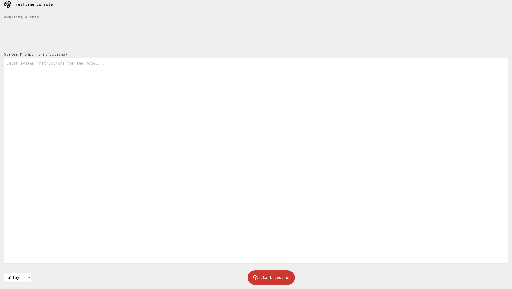

# OpenAI Realtime Console

This is a fork of OpenAI realtime console to enable users to try out different prompts or voices.



-- Original README -- 

This is an example application showing how to use the [OpenAI Realtime API](https://platform.openai.com/docs/guides/realtime) with [WebRTC](https://platform.openai.com/docs/guides/realtime-webrtc).

## Installation and usage

Before you begin, you'll need an OpenAI API key - [create one in the dashboard here](https://platform.openai.com/settings/api-keys). Create a `.env` file from the example file and set your API key in there:

```bash
cp .env.example .env
```

Running this application locally requires [Node.js](https://nodejs.org/) to be installed. Install dependencies for the application with:

```bash
npm install
```

Start the application server with:

```bash
npm run dev
```

This should start the console application on [http://localhost:3000](http://localhost:3000).

This application is a minimal template that uses [express](https://expressjs.com/) to serve the React frontend contained in the [`/client`](./client) folder. The server is configured to use [vite](https://vitejs.dev/) to build the React frontend.

This application shows how to send and receive Realtime API events over the WebRTC data channel and configure client-side function calling. You can also view the JSON payloads for client and server events using the logging panel in the UI.

For a more comprehensive example, see the [OpenAI Realtime Agents](https://github.com/openai/openai-realtime-agents) demo built with Next.js, using an agentic architecture inspired by [OpenAI Swarm](https://github.com/openai/swarm).

## Previous WebSockets version

The previous version of this application that used WebSockets on the client (not recommended in browsers) [can be found here](https://github.com/openai/openai-realtime-console/tree/websockets).

## License

MIT
